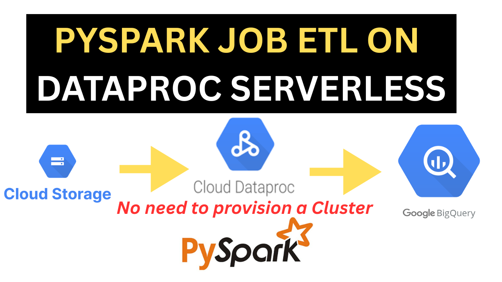

# Lab: How to Run a PySpark ETL Job on Dataproc Serverless?

## Overview

Dataproc Serverless lets you run Spark workloads without requiring you to provision and manage your own Dataproc cluster

In this lab, you'll learn how to take an existing PySpark ETL script and run it in Dataproc Serverless.

---

## Objectives

By the end of this lab, you will be able to:

* Understand how to use **Dataproc Serverless** to run Apache Spark jobs without managing cluster infrastructure.
* Prepare and upload input data and PySpark scripts to a **Google Cloud Storage** bucket.
* Write a PySpark ETL job that:

  * Reads Parquet data from GCS
  * Performs basic data transformations (column selection, filtering, etc.)
  * Writes the results directly into a **BigQuery** table

* Submit and monitor a **Dataproc Serverless batch job** using the `gcloud` command-line interface.
* Use the **Spark-BigQuery connector** to interact with BigQuery from Spark.
* Clean up cloud resources to avoid incurring additional costs.

This hands-on lab will give you a solid foundation for running scalable, serverless data processing pipelines on **Google Cloud Platform**.

---

Find all the gcloud commands used in this lab in this [Medium Article](https://medium.com/@afouda.josue/how-to-run-a-pyspark-etl-job-on-dataproc-serverless-no-need-to-provision-a-cluster-8479e379a4f3).

You can also watch this [YouTube Video](https://youtu.be/cYeGLluWAZY).